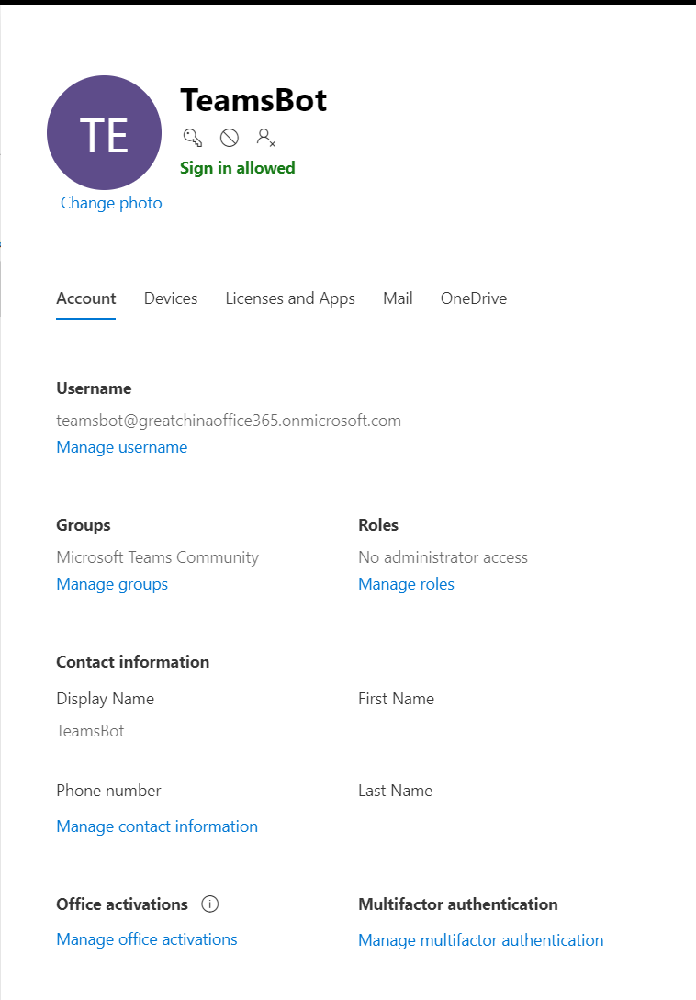

# 用户注册自动化模块

> 作者：陈希章 于 2019-5-11

## 场景和问题描述

创建一个社区本身不难，尤其是如果你已经拥有Teams的话，这得益于Teams的两个重要特性，首先是支持外部用户，其次是有免费版。一旦你决定创建一个社区，接下来随之而来的问题就是：

1. 如何添加外部用户
1. 是否有可能让用户自助注册加入

## 解决方案

### 启用外部用户访问

你有多种方式来启用外部用户访问，请参考官方文档 <https://docs.microsoft.com/en-us/MicrosoftTeams/set-up-guests>, 最常见的做法是在Teams管理中心<https://admin.teams.microsoft.com/>，通过下图的选项进行启用。


> 请注意，修改管理中心的选项，有可能并不会立即生效，如果你发现设置了该选项但没有生效，请稍等一到两小时再试。

### 手工添加用户

其实，你是可以手工地添加用户的。方法也很简单，就是选中你创建的团队，然后在右键菜单中选择 "Add Member"


如果是组织内部用户，你还可以让他们通过多种方式自助加入社区，请参考 <https://support.office.com/en-us/article/Create-a-link-or-a-code-for-joining-a-team-11b0de3b-9288-4cb4-bc49-795e7028296f>

### 外部用户注册表单

但是外部用户默认是无法通过链接或者代码加入团队的，而如果你手工一个一个添加的话，一旦人数比较多，就会比较辛苦。我创建的 "Microsoft Teams 大中华技术社区" 的前面约700人，都是我一把心酸一把泪地手工添加起来的，直到最后我实在觉得这样下去不行，所以才会有了接下来要给大家介绍的这些方法和工具。

> Microsoft Teams目前的单个团队最大允许的用户数是5000人。

所以，我采用的是让用户自行进行注册。为了实现这个需求，我采用的是Office 365中自带的Forms的功能。请通过访问 <https://aka.ms/jointeamsdevcommunity> 体验一下这个表单。


这个表单最起码需要的字段是：邮箱地址和用户名（用来做显示名称）。其他的字段是帮助你了解更多，以便做一定的分析的。

 你可以通过我提供的模板 <https://forms.office.com/Pages/ShareFormPage.aspx?id=v4j5cvGGr0GRqy180BHbR9NNufPMIKNJmM6xKHZY6M9UMk1aT1YzOVFWUjVZRzRTUjBFOVlRNTJCUC4u&sharetoken=hayTTY8EEt8G1uueMiV3> ，快速创建一个类似的表单。

### 处理用户注册信息的流程

有了用户信息，接下来如何自动地将用户添加到对应的社区里面去呢？这里需要用到微软官方提供的一个PowerShell的模块（MicrosoftTeams），它包含了多个很有用的命令，本指南会用到如下两个命令


你可以通过下面的方式在本地安装这个PowerShell模块，并且获取你所创建的社区所对应的Team的编号。

 请使用**管理员**身份启动PowerShell命令行，然后输入 `Install-Module MicrosoftTeams` 并且按照提示完成安装。


通过 `Connect-MicrosoftTeams`命令连接到服务，并且通过 `Get-Team` 这个命令，获取你所管理的社区对应Team的信息。


 请立即把结果集中的GroupId保存下来。**这个是关键信息，后续需要用到**。

那么，接下来如何实现自动地往这个团队中添加用户呢？我们这个解决方案采用了Azure Automation来实现自动化，它可以在云端执行PowerShell脚本，而且支持WebHook的调用。

 请按照 <https://docs.microsoft.com/en-us/azure/automation/automation-quickstart-create-account> 的说明，创建一个Automation account。

接下来，需要在这个Automation account中添加一个用来执行脚本的账号，这个账号必须是你要自动化管理团队的所有者（Owner），而且一定不能启用MFA（多因子身份认证），但这个账号可以没有任何的License，请注意设置密码永不过期。例如我为"Microsoft Teams 大中华技术社区" 所创建的一个TeamsBot账号如下



 在Automation account的credentials页面，创建一个对应的凭据，请参考下图,并记录下来你的凭据名称，后续要用到。


接下来我们需要导入两个PowerShell模块到当前这个Automation account，他们分别是

1. MicrosoftTeams
1. AzureAD

请通过下图所示菜单导入以上两个模块


有了如上的准备，接下来是实质性的步骤了，我们可以创建一个runbook来实现自动化。关于在Automation account中创建runbook的步骤，请参考 <https://docs.microsoft.com/en-us/azure/automation/automation-quickstart-create-runbook>, 请注意选择Runbook type 为PowerShell。然后编辑代码如下：

``` powershell

# define the parameter
# author: Ares Chen
param (
    [object] $WebhookData
)

# parse the input data
$data = ConvertFrom-Json $WebhookData.RequestBody

# extract the parameter
$username =$data.username
$email =$data.email
$teamid =$data.teamid

# Get the credential to execute the powershell cmdlet, this account must not enable MFA
$credential = Get-AutomationPSCredential -Name 'teamsbot'

# Connect to the environment
Connect-AzureAD -Credential $credential
Connect-MicrosoftTeams -Credential $credential

#Invite people to AAD
New-AzureADMSInvitation -InvitedUserEmailAddress $email -InvitedUserDisplayName $username -InviteRedirectURL https://teams.microsoft.com/ -SendInvitationMessage $true -ErrorAction SilentlyContinue

#Add user to community
Add-TeamUser -GroupId $teamid -User $email

```

 代码视图看起来像下面这样，请注意选择 "Save" 和 "Publish" 按钮。


接下来，为了让外界能够调用这个runbook，我们可以选择为其创建一个webhook，请通过选择"add webhook" 来实现，该操作将帮助你生成一个地址供外界调用。关于如何创建webhook，请参考 <https://docs.microsoft.com/en-us/azure/automation/automation-webhooks>


那么，谁来触发和调用这个webhook呢？我的做法是采用Flow来监听用户提交的Forms的内容，并且在其内部来通过HTTP组件调用这个Webhook.


为了方便大家，我这里也导出一个模板供使用。

 请先下载这个模板 [FormsToteams-FlowTemplate](formstoteams-flow_20190512131257.zip)，然后在Microsoft Flow的界面上，选择 "My Flows" 这个页面顶部的 "Import"按钮，并且按照提示完成导入后，稍作一些修改即可。


这就是我目前采用的完整方案，可以全自动实现用户信息收集，并且添加到Teams的团队中，请尽情使用，如果有什么问题，请及时反馈给我。